# How to create a BareMetal Ethernet application on STM32H563/STM32H723 without Middlewares

**Summary**

When searching for Ethernet peripheral examples in STM32CubeMX, we find that we are limited to examples utilizing middlewares such as NetXDuo and LWIP. Although these middlewares are immensely helpful in creating connected applications, there are no examples showcasing a bare-metal implementation using the Ethernet driver.
This repository can be used directly by using two similar boards H5-H5 or H5-H7 with a corssover cable directly or and ethernet switch.
you can find detailed description on how to build it yoursef bellow or in this ST community [article](https://community.st.com/t5/stm32-mcus/how-to-create-a-bare-metal-hal-ethernet-application-on-stm32h563/ta-p/699164).

**Prerequisites**

This project utilizes the following software and hardware environment:

- STM32H563ZI/STM32H723ZG
- STM32CubeIDE v1.16
- STM32CubeMX v6.12
- Terminal emulation Software (Putty, TeraTerm…)

**Project objectives**

This application guides STM32Cube HAL API users to:

- Configure the Ethernet peripheral pinout.
- Configure the Ethernet transmit (Tx) and receive (Rx) descriptors.
- Construct Ethernet frames to be sent and received upon triggering an EXTernal Interrupt.

 **1 Board configuration using CubeMX**

  **1.1 Board initialization**

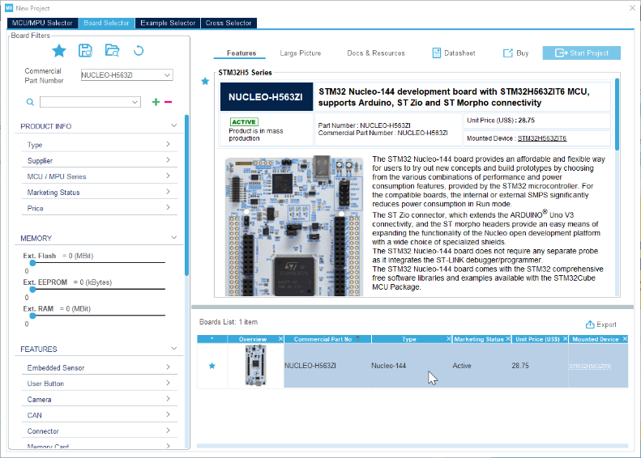

The first step is to open STM32CubeMX and search for one of the boards we mentioned in the perquisites section. In our case, we will be using the STM32H563ZI.

You will be prompted to decide whether to activate **TrustZone**.


Select "Without TrustZone" as we will not be using TrustZone for this example.

Before starting the Ethernet configuration, it is recommended to clear all the default-mapped pins. This can be done by following the steps outlined below:

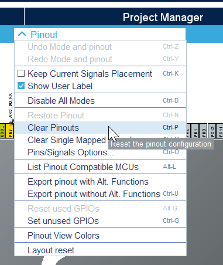

 **1.2 UART configuration**

To simplify the debugging process, we will use UART to print out debug messages to a serial terminal. To do this, we need to configure the appropriate UART that is connected to the on-board ST-Link Virtual COM Port (VCP). By inspecting the STM32H563ZI board schematic [board schematic](https://www.st.com/en/evaluation-tools/nucleo-h563zi.html#cad-resources) and searching for 'VCP', we find that USART3 is connected to the VCP by default.

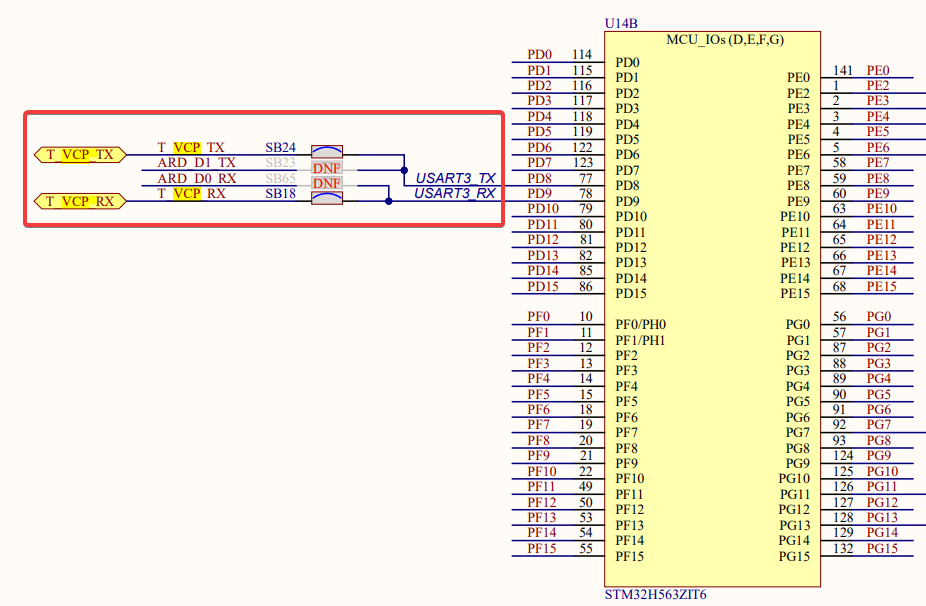

We will enable USART3 in asynchronous mode and retain the default configuration. The only modification required is the pin assignment to ensure that UART is mapped to the Virtual COM Ports, meaning:

Assign **USART3_RX** to **PD9** and **USART3_TX** to **PD8.**

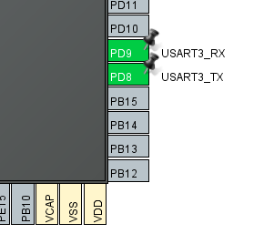

**1.3 GPIO configuration**

Next, we'll configure the GPIO for the user button to act as an external interrupt, initiating data transmission/reception upon activation. According to UM3115, the user button is mapped to PC13. Configure this in STM32CubeMX as follows:

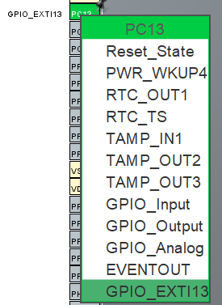
**1.4 Ethernet peripheral configuration**

For Ethernet configuration, begin by enabling the peripheral in RMII mode, which is supported by our board and uses fewer pins (7 pins) compared to MII mode (16 pins). As with the USART3 configuration, ensure that the pins are correctly mapped to the MCU. Adhere to the pin configuration as detailed in the board schematic:

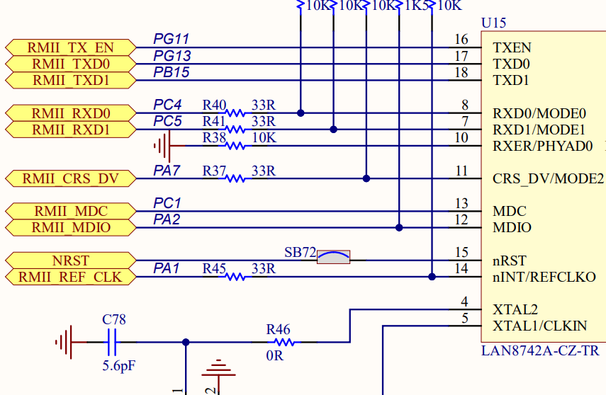

Next, increase the GPIO pins' Maximum Output Speed to **Very High** in the GPIO Settings. To do this quickly, select the first pin, hold **Shift**, and then select the last pin to highlight all pins in between. Now, scroll down and set the Maximum Output Speed to **Very High** as shown below:

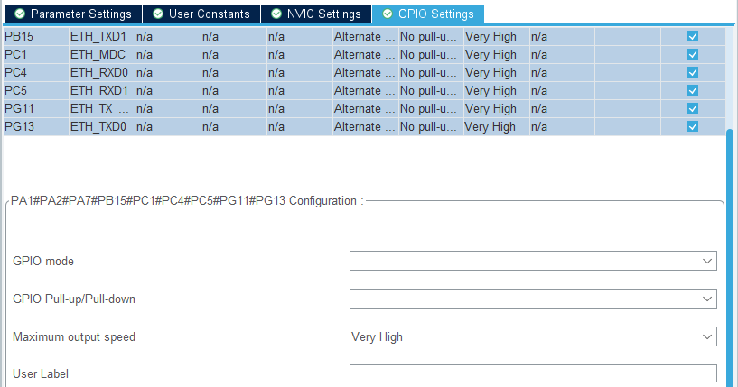

Finally, since we are using Ethernet in interrupt mode for this example, enable the Ethernet global interrupt in the NVIC Settings.

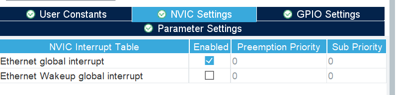

**1.5 NVIC configuration**

As previously mentioned, this example operates in interrupt mode, so we must configure the NVIC. Enable the EXTI Line 13 interrupt, which corresponds to the user button, and set the Preemption Priority of the Ethernet global interrupt to 7

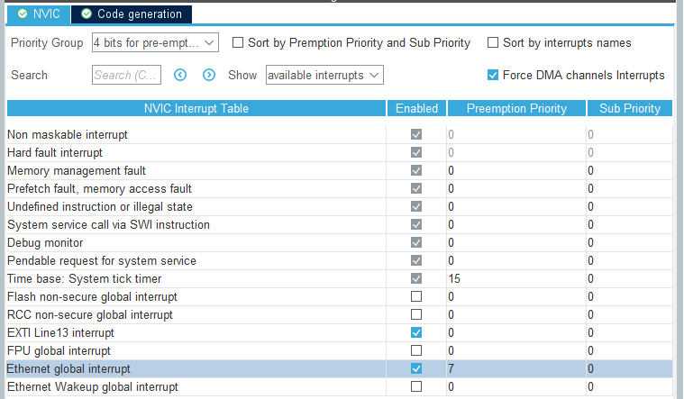
     
**1.6Clock configuration**

For clock configuration, start by adjusting the RCC mode to select Crystal/Ceramic Resonator as the High-Speed Clock. Then, in the Clock Configuration tab, use HSI as the PLL1 Source Mux and PLLCLK as the System Clock Mux to achieve a frequency of 250MHz, as illustrated in the clock tree.

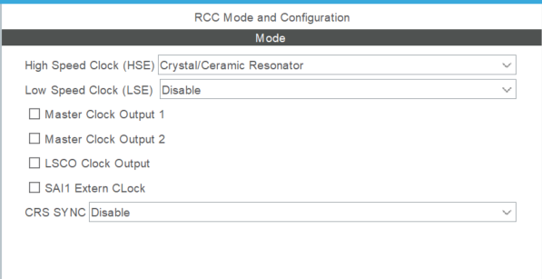

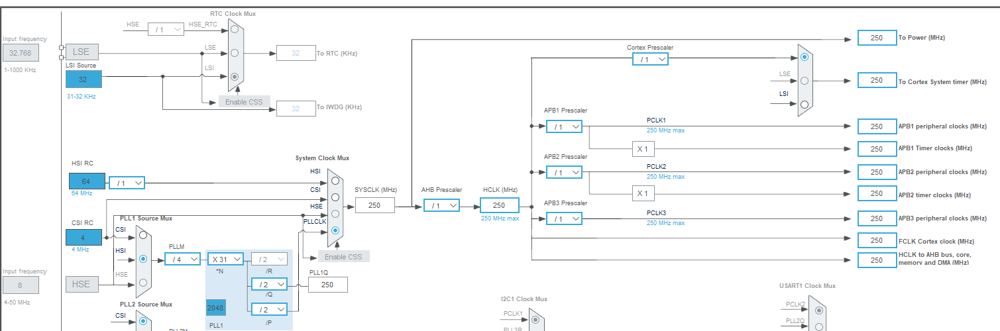

**1.7Linker Settings**

Ethernet frames can be up to **1524 bytes** in size, or up to **9000 bytes** with Jumbo frames enabled. Therefore, it's essential to increase the heap size to accommodate **4 Rx Buffers**. The significance of this configuration will be explained later in the guide. Why 4 Rx Buffers? In the Ethernet configuration tab of STM32CubeMX, we find the following:


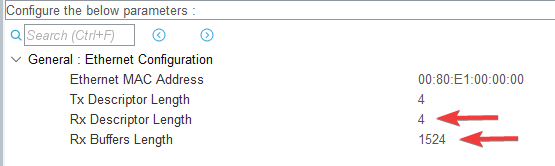

To calculate the necessary heap space, multiply the Rx Buffer Length by the Number of Rx Descriptors, as each buffer is associated with a descriptor:

**Required Heap Space** = 1524 bytes per buffer \* 4 buffers = 6096 bytes

This equals **0x17D0** in hexadecimal. We'll round it up to **0x2000** to allow for any additional requirements.

**Note:** in our case we will be testing with simple messages so we will use small buffers

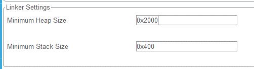

All that remains is to choose a name for the project and click **Generate Code**. You will receive a warning about not enabling ICACHE. Select **Yes** to proceed with code generation.

**2 Application programming in STM32CubeIDE**

**2.1 Configure USART3**

As mentioned, we'll use USART3 to output debug messages through the ST-Link Virtual COM Port (VCP). To simplify the process, we'll redirect the printf function to HAL_UART_Transmit. Implement this by adding the following code snippets to the appropriate sections of our application:
```c
/* USER CODE BEGIN PD */
#ifdef __GNUC__
#define PUTCHAR_PROTOTYPE int __io_putchar(int ch)
#else
#define PUTCHAR_PROTOTYPE int fputc(int ch, FILE *f)
#endif
/* USER CODE END PD */
/* USER CODE BEGIN 0 */
int __io_putchar(int ch)
{
  /* Place your implementation of fputc here */
  /* e.g. write a character to the USART3 and Loop until the end of transmission */
  HAL_UART_Transmit(&huart3, (uint8_t *)&ch, 1, 0xFFFF);
  return ch;
}
/* USER CODE END 0 */

```


Don’t forget to include &lt;stdio.h&gt; since we are going to use printf.

**2.2 Configuring PHY**

Before configuring Ethernet descriptors, we must set up the physical interface. This involves importing the PHY library into our project and preparing the configuration for the initialization function. To import the source and header files:

- Drag lan8742.h into the Inc/ folder.
- Drag lan8742.c into the Src/ folder.

These files are typically located at:

C:\\Users\\\[YOUR USERNAME\]\\STM32Cube\\Repository\\STM32Cube_FW_H5_V1.1.1\\Drivers\\BSP\\Components\\lan8742

If done correctly, your folder structure should now include:

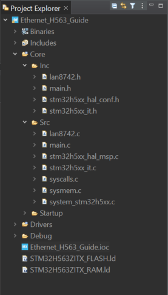

Once the files are in the correct folders, you can include lan8742.h in your project as follows:

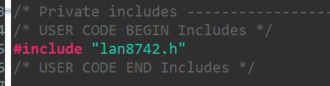

For PHY initialization, declare a struct and assign private IO functions to it, enabling the following tasks:

- Initialize the MDIO clock, corresponding to the signal used for sending and receiving data to and from PHY registers.
- De-initialize the PHY.
- Read the contents of a specific register.
- Write data to a specific register.
- Get the current Tick value.

Declare the struct and write the function prototypes in the appropriate area as follows:
```c
/* USER CODE BEGIN PFP */
int32_t ETH_PHY_INTERFACE_Init(void);
int32_t ETH_PHY_INTERFACE_DeInit (void);
int32_t ETH_PHY_INTERFACE_ReadReg(uint32_t DevAddr, uint32_t RegAddr, uint32_t *pRegVal);
int32_t ETH_PHY_INTERFACE_WriteReg(uint32_t DevAddr, uint32_t RegAddr, uint32_t RegVal);
int32_t ETH_PHY_INTERFACE_GetTick(void);
/* USER CODE END PFP */
/* Private user code ---------------------------------------------------------*/
/* USER CODE BEGIN 0 */
lan8742_Object_t LAN8742;
lan8742_IOCtx_t  LAN8742_IOCtx = {ETH_PHY_INTERFACE_Init,
                                  ETH_PHY_INTERFACE_DeInit,
                                  ETH_PHY_INTERFACE_WriteReg,
                                  ETH_PHY_INTERFACE_ReadReg,
                                  ETH_PHY_INTERFACE_GetTick};
```
Now, implement the previously declared functions so they can be utilized when called. Copy the following implementations into your main file:
```c
/* USER CODE BEGIN 4 */
int32_t ETH_PHY_INTERFACE_Init(void)
{
  /* Configure the MDIO Clock */
  HAL_ETH_SetMDIOClockRange(&heth);
  return 0;
}
int32_t ETH_PHY_INTERFACE_DeInit (void)
{
  return 0;
}
int32_t ETH_PHY_INTERFACE_ReadReg(uint32_t DevAddr, uint32_t RegAddr, uint32_t *pRegVal)
{
  if(HAL_ETH_ReadPHYRegister(&heth, DevAddr, RegAddr, pRegVal) != HAL_OK)
  {
    return -1;
  }
  return 0;
}
int32_t ETH_PHY_INTERFACE_WriteReg(uint32_t DevAddr, uint32_t RegAddr, uint32_t RegVal)
{
  if(HAL_ETH_WritePHYRegister(&heth, DevAddr, RegAddr, RegVal) != HAL_OK)
  {
    return -1;
  }
  return 0;
}
int32_t ETH_PHY_INTERFACE_GetTick(void)
{
  return HAL_GetTick();
}
/* USER CODE END 4 */


```

The last step in the PHY groundwork is to create a function for handling speed and duplex auto-negotiation. This function will :

1. Check if the PHY is properly initialized by reading the Link state.
2. Assign the corresponding speed and duplex settings to variables used to adjust the MAC configuration.
3. Call the Ethernet start function in interrupt mode to initiate transmission/reception at the MAC and DMA layers.

Copy the code for this function below the PHY initialization functions within the /\* USER CODE BEGIN 4 \*/ section, and don't forget to declare the function prototype above.
```c
void ETH_StartLink()
{
  ETH_MACConfigTypeDef MACConf = {0};
  int32_t PHYLinkState = 0U;
  uint32_t linkchanged = 0U, speed = 0U, duplex =0U;
  PHYLinkState = LAN8742_GetLinkState(&LAN8742);
  if(PHYLinkState <= LAN8742_STATUS_LINK_DOWN)
  {
    HAL_ETH_Stop(&heth);
  }
  else if(PHYLinkState > LAN8742_STATUS_LINK_DOWN)
  {
    switch (PHYLinkState)
    {
    case LAN8742_STATUS_100MBITS_FULLDUPLEX:
      duplex = ETH_FULLDUPLEX_MODE;
      speed = ETH_SPEED_100M;
      linkchanged = 1;
      break;
    case LAN8742_STATUS_100MBITS_HALFDUPLEX:
      duplex = ETH_HALFDUPLEX_MODE;
      speed = ETH_SPEED_100M;
      linkchanged = 1;
      break;
    case LAN8742_STATUS_10MBITS_FULLDUPLEX:
      duplex = ETH_FULLDUPLEX_MODE;
      speed = ETH_SPEED_10M;
      linkchanged = 1;
      break;
    case LAN8742_STATUS_10MBITS_HALFDUPLEX:
      duplex = ETH_HALFDUPLEX_MODE;
      speed = ETH_SPEED_10M;
      linkchanged = 1;
      break;
    default:
      break;
    }
    if(linkchanged)
    {
      HAL_ETH_GetMACConfig(&heth, &MACConf);
      MACConf.DuplexMode = duplex;
      MACConf.Speed = speed;
      MACConf.DropTCPIPChecksumErrorPacket = DISABLE;
      MACConf.ForwardRxUndersizedGoodPacket = ENABLE;
      HAL_ETH_SetMACConfig(&heth, &MACConf);
      HAL_ETH_Start_IT(&heth);  
      }
  }
}

```
Note that CRC checking is disabled in this example, as CRC calculation during transmission from the PC is not included. You are welcome to implement your own function and re-enable this feature in the MAC configuration. Additionally, for testing purposes with short payloads (size < 64 bytes), the ForwardRxUndersizedGoodPacket option should be enabled.

**2.3 Configuring Ethernet**

**2.3.1 Buffers memory allocation**

When HAL_ETH_START_IT() is called, it begins by constructing descriptors. It populates the previously zero-initialized descriptors with values corresponding to user-selected features, such as VLAN, TSO, PTP, etc. To build the receive descriptors, memory blocks must be allocated for each descriptor, necessitating the definition of the HAL_ETH_RxAllocateCallback function.
```c
void HAL_ETH_RxAllocateCallback(uint8_t ** buff) {
  ETH_BufferTypeDef * p = malloc(100);
  if (p)
  {
    * buff = (uint8_t * ) p + offsetof(ETH_AppBuff, buffer);
    p -> next = NULL;
    p -> len = 100;
  } else {
    * buff = NULL;
  }
}
```
The HAL_ETH_RxAllocateCallback function begins by calling malloc (ensure to include &lt;stdlib.h&gt;) to allocate a block of 100 bytes. The buffer address is then aligned with the buffer address member in the ETH_AppBuff structure. This structure facilitates the organization of each frame and its contents in a forward-linked list. The struct is declared as follows:
```c
/* USER CODE BEGIN PTD */
typedef struct {
    ETH_BufferTypeDef *AppBuff;
    uint8_t buffer[100]__ALIGNED(32);
} ETH_AppBuff;
/* USER CODE END PTD */

```
**2.3.2 Frame organization**

Since we are working with forward-linked lists, we need to define a function that constructs this chain of nodes, organizing it to ensure flawless frame reconstruction. In this case, we have **HAL_ETH_RxLinkCallback()**. The implementation is as follows:
```c
void HAL_ETH_RxLinkCallback(void ** pStart, void ** pEnd, uint8_t * buff, uint16_t Length)
{
  ETH_BufferTypeDef ** ppStart = (ETH_BufferTypeDef ** ) pStart;
  ETH_BufferTypeDef ** ppEnd = (ETH_BufferTypeDef ** ) pEnd;
  ETH_BufferTypeDef * p = NULL;
  p = (ETH_BufferTypeDef * )(buff - offsetof(ETH_AppBuff, buffer));
  p -> next = NULL;
  p -> len = 100;
  if (! * ppStart)
  {
    * ppStart = p;
  } else
  {
    ( * ppEnd) -> next = p;
  }
  * ppEnd = p;
}
```
**2.3.3 Finalizing Ethernet finalization**

Now that we have prepared all the necessary functions to operate the Ethernet on the STM32H5, all that remains is to call these functions in MX_ETH_Init() as shown below:
```c
  /* USER CODE BEGIN ETH_Init 2 */
  /* Set PHY IO functions */
  LAN8742_RegisterBusIO(&LAN8742, &LAN8742_IOCtx);
  /* Initialize the LAN8742 ETH PHY */
  LAN8742_Init(&LAN8742);
  /* Initialize link speed negotiation and start Ethernet peripheral */
  ETH_StartLink();
  /* USER CODE END ETH_Init 2 */
```

We can also define callback functions for HAL_ETH_TxCpltCallback and HAL_ETH_RxCpltCallback to be executed upon successful transmission or reception, respectively.
```c
void HAL_ETH_TxCpltCallback(ETH_HandleTypeDef * heth)
{
  printf("Packet Transmitted successfully!\r\n");
  fflush(0);
}
void HAL_ETH_RxCpltCallback(ETH_HandleTypeDef * heth)
{
  printf("Packet Received successfully!\r\n");
  fflush(0);
}
```
If all goes well, you should get no errors or warnings when you build the project.

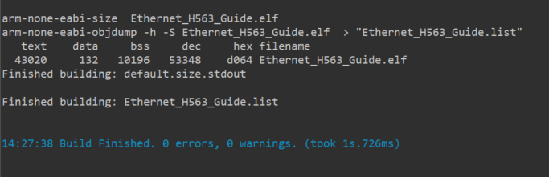

**3 Testing the application**

To test our application, we will construct a Ping Pong communication between an STM32H723 board and STM32H563 board. When one of the boards transmits a frame, the other board will receive the data and sends a response. This process will repeat itself until interrupted by the user.

**3.1 Transmit configuration**

We are going to construct a basic Ethernet frame, prepare the Tx Descriptor, and send it to another host. To do this, we will start by creating a function that constructs an Ethernet frame from given arguments. A simple implementation might look like the following:
```c
void ETH_ConstructEthernetFrame(ethernet_frame_t * frame, uint8_t * dest_mac, uint8_t * src_mac, uint8_t * type, uint8_t * payload, uint16_t payload_len)
{
  // Copy the destination MAC address
  memcpy(frame -> dest_mac, dest_mac, 6);
  // Copy the source MAC address
  memcpy(frame -> src_mac, src_mac, 6);
  // Set the Ethernet type field
  memcpy(frame -> type, type, 2);
  // Copy the payload data
  memcpy(frame -> payload, payload, payload_len);
}
```

To facilitate data placement in Ethernet frame fields, we will create a struct that comprises these fields. It looks like the following:
```c
typedef struct {
    uint8_t dest_mac[6];
    uint8_t src_mac[6];
    uint8_t type[2];
    uint8_t payload[100];
} ethernet_frame_t;

```
Next, we can construct our frame by calling the function we defined earlier with values of our choosing. Here, I have chosen to send a frame with a custom payload that I have encoded in hexadecimal and chose the STM32H723 board MAC address as destination address.
```c
 /* USER CODE BEGIN 1 */
 ETH_BufferTypeDef TxBuffer;
 ethernet_frame_t frame;
 uint8_t dest_mac[] = {0x00, 0x80, 0xE1, 0x00, 0x00, 0x10}; // Destination MAC Address
 uint8_t src_mac[] = {0x00, 0x80, 0xE1, 0x00, 0x00, 0x00};  // Source MAC Address
 uint8_t type[] = {0x08,0x00 }; // EtherType set to IPV4 packet
 uint8_t payload[] = {0x54,0x65,0x73,0x74,0x69,0x6e,0x67,0x20,0x45,0x74,0x68,0x65,0x72,0x6e,0x65,0x74,0x20,0x6f,0x6e,0x20,0x53,0x54,0x4d,0x33,0x32};
 uint16_t payload_len = sizeof(payload);
 /* USER CODE END 1 */

```
Now, we can call the frame construction function we just defined and prepare a transmit buffer, as illustrated in the example below.
```c
/* USER CODE BEGIN 2 */
ETH_ConstructEthernetFrame(&frame, dest_mac, src_mac, type, payload, payload_len);
TxBuffer.buffer = (uint8_t *)&frame;
TxBuffer.len = sizeof(dest_mac) + sizeof(src_mac) + sizeof(type) + payload_len;
TxBuffer.next = NULL;
TxConfig.TxBuffer = &TxBuffer;
/* USER CODE END 2 */

```
Moving on, we will utilize the user button configured in CubeMX to transmit a frame upon detecting a rising edge external interrupt. Therefore, we must define the HAL_GPIO_EXTI_Callback() function in the user section to be executed when the button is pressed.
```c
void HAL_GPIO_EXTI_Callback(uint16_t GPIO_Pin) 
{
  if (GPIO_Pin == GPIO_PIN_13) {
    HAL_ETH_Transmit_IT( & heth, & TxConfig);
    HAL_ETH_ReleaseTxPacket( & heth);
    HAL_ETH_ReadData( & heth, (void ** ) & frame_Rx);
  } else {
    __NOP();
  }
}

```
**3.2 Callback configuration**

To maintain the continuous exchange in the ping-pong communication protocol, it's essential to establish the appropriate callback functions corresponding to each event: **Transmit Complete** and **Receive Complete**. In each of these functions, we will perform a simple action: toggling an LED. Specifically, within the Receive Complete callback (denoted as RxCplt), we will not only toggle an LED but also initiate a new transmission upon the successful reception of data. This ensures that for every reception of a frame, another frame is transmitted in response, perpetuating the communication cycle. The following code snippet should be implemented identically on both boards to achieve the desired ping-pong effect:
```c
void HAL_ETH_TxCpltCallback(ETH_HandleTypeDef * heth)
{
  printf("[%d] Packet Transmitted to H5!\r\n", ++inc);
  fflush(0);
  HAL_GPIO_WritePin(Led_Red_GPIO_Port, Led_Red_Pin, GPIO_PIN_RESET);
  HAL_GPIO_WritePin(Led_Green_GPIO_Port, Led_Green_Pin, GPIO_PIN_RESET);
  HAL_GPIO_WritePin(Led_Orange_GPIO_Port, Led_Orange_Pin, GPIO_PIN_RESET);
  HAL_GPIO_WritePin(Led_Green_GPIO_Port, Led_Green_Pin, GPIO_PIN_SET);
}
void HAL_ETH_RxCpltCallback(ETH_HandleTypeDef * heth)
{
  HAL_ETH_ReadData(heth, (void ** ) & frame_Rx);
  printf("[%d] Packet Received from H5!\r\n", ++inc);
  fflush(0);
  HAL_ETH_Transmit_IT(heth, & TxConfig);
  HAL_ETH_ReleaseTxPacket(heth);
  HAL_GPIO_WritePin(Led_Red_GPIO_Port, Led_Red_Pin, GPIO_PIN_RESET);
  HAL_GPIO_WritePin(Led_Green_GPIO_Port, Led_Green_Pin, GPIO_PIN_RESET);
  HAL_GPIO_WritePin(Led_Orange_GPIO_Port, Led_Orange_Pin, GPIO_PIN_RESET);
  HAL_GPIO_WritePin(Led_Orange_GPIO_Port, Led_Orange_Pin, GPIO_PIN_SET);
}

```
**3.3 Demonstration**

Finally, all that's left to do is build the project and test it. To do that, we need to open a terminal emulator and connect to the Serial COM port at the correct speed. After running our project and initializing all the necessary peripherals, we can attempt to send an Ethernet frame to the board. If successful, this will trigger the callback function, which will start the ping pong communication between the two boards.

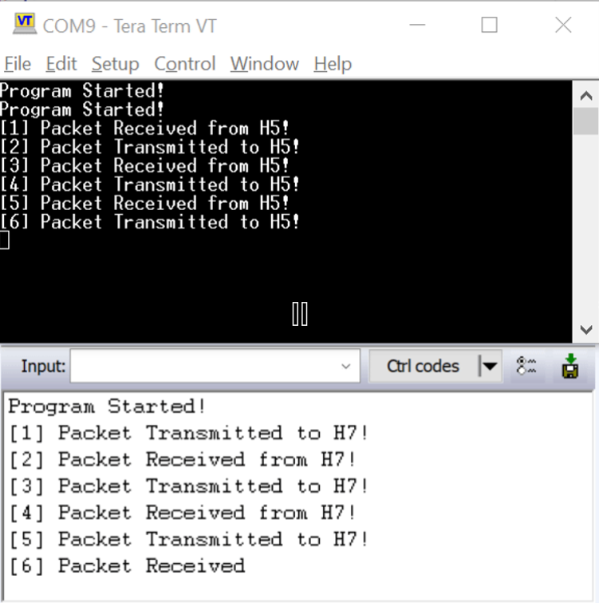
**PS:** This example does not handle memory management of received packets, it serves only as a mean to explain the programming process of ethernet to ease the setup when using middlewares

# Debugging tips

**How to ensure PHY is working correctly?**

In the PHY library (lan8742.h), the LAN8742_GetLinkState function is utilized to check the state of the PHY device specified in the parameters. As illustrated below, this function returns status codes that indicate the link status. It informs us if the link is up or down, the result of the auto-negotiation process, and the selected speed and duplex settings. Additionally, it could signal if an error occurred during the read/write process to or from the registers.

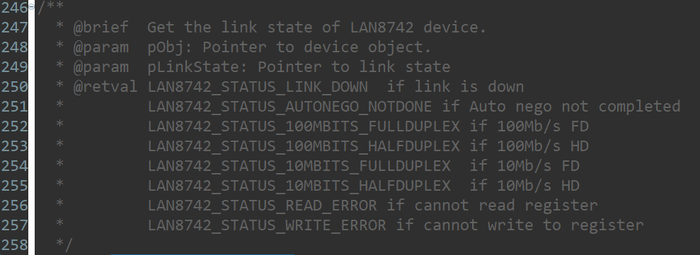

**How to ensure Ethernet is working correctly?**

Ensuring the correct functionality of an Ethernet peripheral involves checking specific key registers and verifying that they contain the correct values. Like other peripherals, Ethernet has numerous registers associated with each layer of its architecture, which can make the debugging process time-consuming and tedious without knowledge of the critical areas to examine. To streamline this process, here are some key registers that can significantly reduce the time spent when debugging an Ethernet application:

- **Debug status register (ETH_DMADSR)**

This register provides us with the state of the Finite State Machine (FSM) for both DMA channels, transmit (Tx) and Receive (Rx). It allows us to determine whether the Ethernet is functioning correctly. If there are issues, the register can help pinpoint the exact stage where the process is experiencing a hang-up.

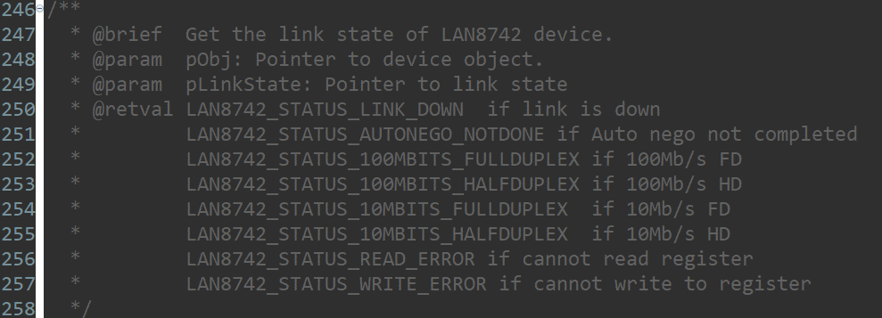

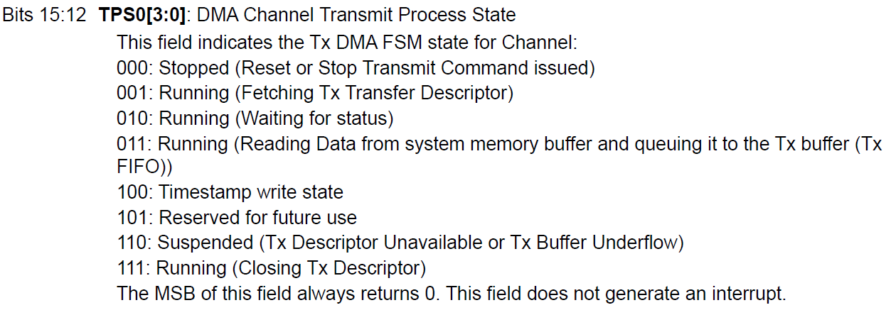

- **Channel status register (ETH_DMACSR)**

During each interrupt routine, the application reads the status register to determine the current status of the DMA. This status can be found in the ETH_DMACSR register, which provides information on whether the transmit or receive process has been completed or if it has been halted due to an error. The types of errors that can be detected include unavailable receive or transmit buffers (RBU/TBU), context descriptor errors (CDE), or even fatal bus errors.

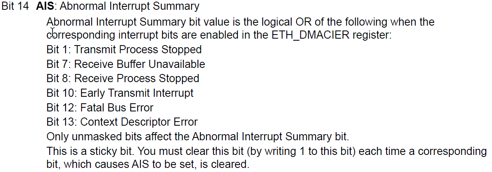

**How to trace received packets in each layer?**

Before starting the tracing process, we need to make sure that the ethernet has been initialized successfully by reading the value of the debug register (ETH_DMADSR), it should contain the value 3 (011) which indicates that the receive process is running correctly. Next, we can start checking the following registers:

- **Rx unicast packets good register (ETH_RX_UNICAST_PACKETS_GOOD)**

As implied by its name, this register increments with each detected unicast packet. By monitoring this register, we can determine whether the packet sent has been recognized by the first layer of the board's networking hardware.

Upon reception, each packet is forwarded to the MAC Transaction Layer (MTL), where it is temporarily stored. Subsequently, the DMA engine is responsible for transmitting the packet to the system memory. Therefore, the next critical step in the debugging process is to verify the buffer address pointer, which should correctly reference the memory location where the packet data is to be stored or retrieved. Ensuring that this pointer is accurate is vital for the seamless transfer of data between the MTL and system memory.

- **Channel current application receive buffer register (ETH_DMACCARXBR)**

This register is updated by the DMA during read operations and holds the destination memory address where the received data will be transferred from the MAC Transaction Layer.

**Possible errors that prevent packets from reaching system memory**

- **Ethernet not initialized correctly:** this issue could stem from various causes, most notably when the PHY does not complete the auto-negotiation process. In such instances, the problem could be as straightforward as an improperly connected RJ45 cable. Additionally, misconfigured descriptors can also lead to communication failures. It is critical to ensure that each descriptor is correctly associated with a memory block where data will be stored.
- **Undersized packets**: to address the issue of packets that are error-free but shorter than 64 bytes, there are a couple of solutions. One approach is to increase the size of the payload being sent to meet the minimum length requirement. Alternatively, the FUP (Forward Undersized Good Packets) bit in the ETH_MTLRXQOMR (MAC Transaction Layer Receive Queue Operation Mode Register) can be toggled to allow these undersized packets to bypass the length check and be forwarded as valid packets.
- **CRC error**: the Ethernet peripheral includes a mechanism for offloading CRC (Cyclic Redundancy Check) calculation and verification. When a packet is prepared for transmission, a checksum is calculated and appended to the end of the frame to ensure data integrity. Similarly, upon receiving a frame, the CRC field is examined to verify the packet's integrity. If the packet is found to be erroneous, it is immediately discarded. However, if we want to bypass this integrity check, the corresponding bit in the ETH_MTLRXQOMR (MAC Transaction Layer Receive Queue Operation Mode Register) can be toggled. This action disables the CRC error checking, allowing frames to be accepted even if the CRC does not match.
## Questions & Feedback

If you see any issue with this examples you can start thread on [ST community](https://community.st.com)

## References 
[Reference manual: RM0481](https://www.st.com/resource/en/reference_manual/rm0481-stm32h52333xx-stm32h56263xx-and-stm32h573xx-armbased-32bit-mcus-stmicroelectronics.pdf)

[Knowledge article: Debugging tips when working with an Ethernet peripheral ](https://community.st.com/t5/stm32-mcus/debugging-tips-when-working-with-an-ethernet-peripheral/ta-p/696898)
